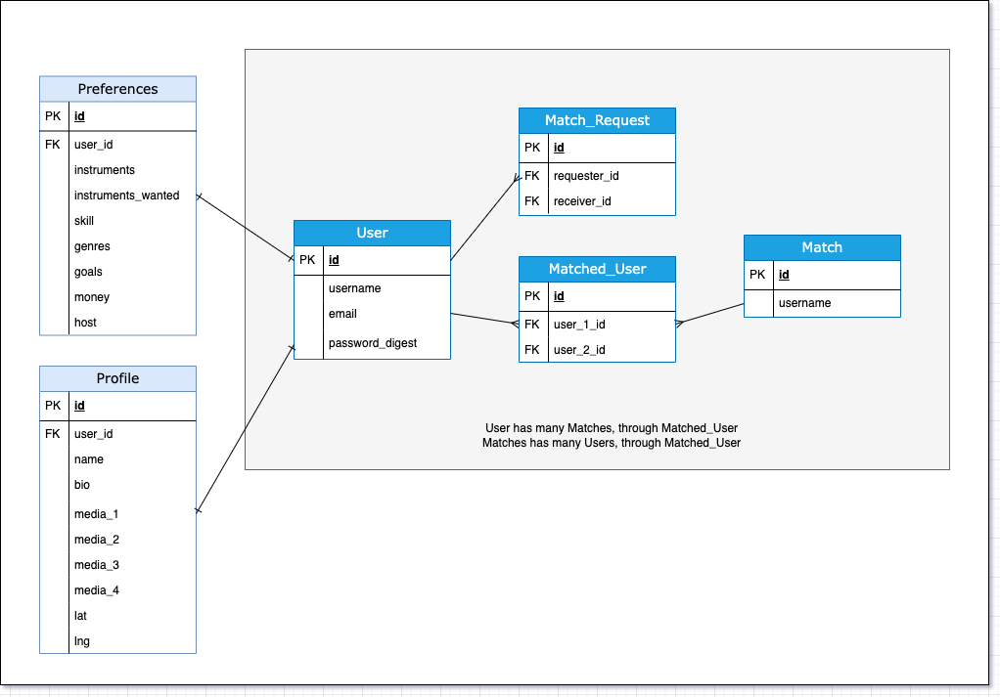

# README

Timbre (pronounced TOM-ber) is a match-making app that helps musicians find other musicians nearby.  

## How to Install

Fork and clone from GitHub: 

https://github.com/mikahado/timbre-proj

From the root directory, run:  

~~~
npm install --prefix client
bundle install
~~~

Start the cliet:

~~~
npm start --prefix client
~~~

Start the server:

~~~
rails server 
~~~

## About 

Timbre, pronounced ‘TOM-ber’ or ‘TAM-ber’, means: “the quality of sound that is produced by a particular voice or musical instrument.”

Timbre is designed to promote networking and discovery among musicians, for beginners to professionals, students and teachers. 

Unlike any app of its kind, Timbre uses a model inspired by dating apps to connect creative musicians to other creative musicians. (But it is NOT a dating app)!

## Google Maps API 

To match nearby artists, Timbre uses Google Maps JavaScript API with geolocation. 

Follow the most recent install instructions from [Google API.](https://developers.google.com/maps/documentation/javascript/overview)

Install the pack, if not already installed: [npm package](https://www.npmjs.com/package/@react-google-maps/api)

## Chat Feature

Timbre utilizes CometChat for its chat functionality. 

Follow the most recent install instructions from CometChat:
[Cometchat React UI Kit](https://www.cometchat.com/docs/react-chat-ui-kit/overview)

   

## Technical Information

Entity-Relationship Diagram

